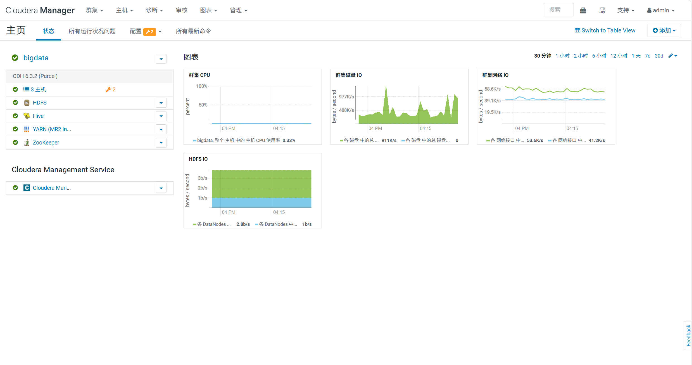
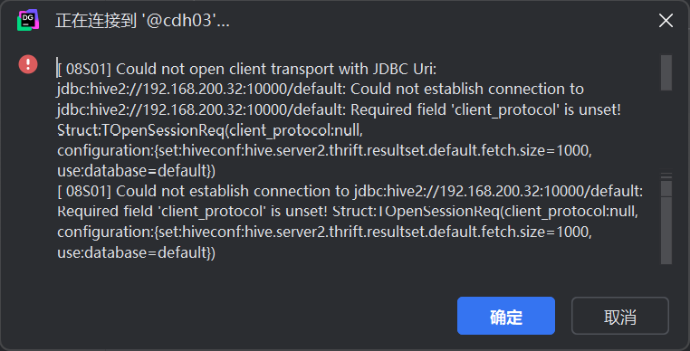
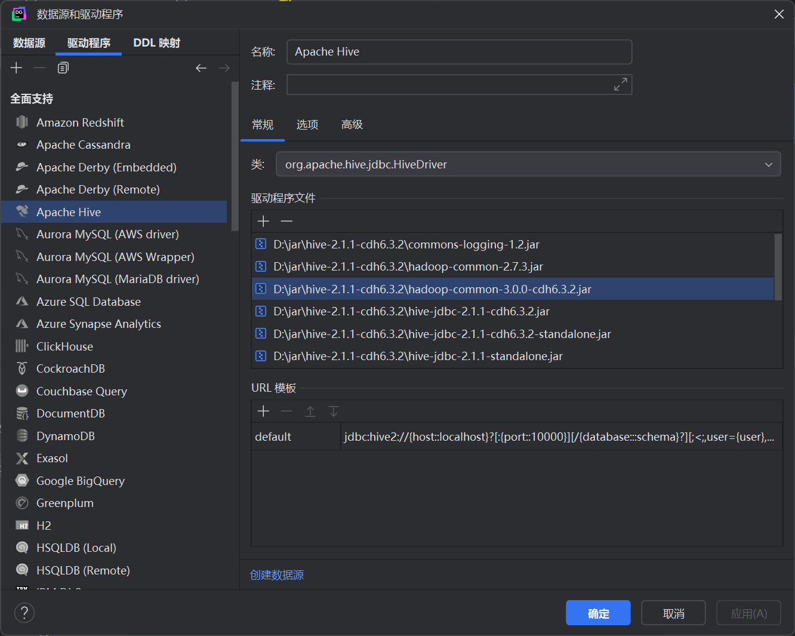
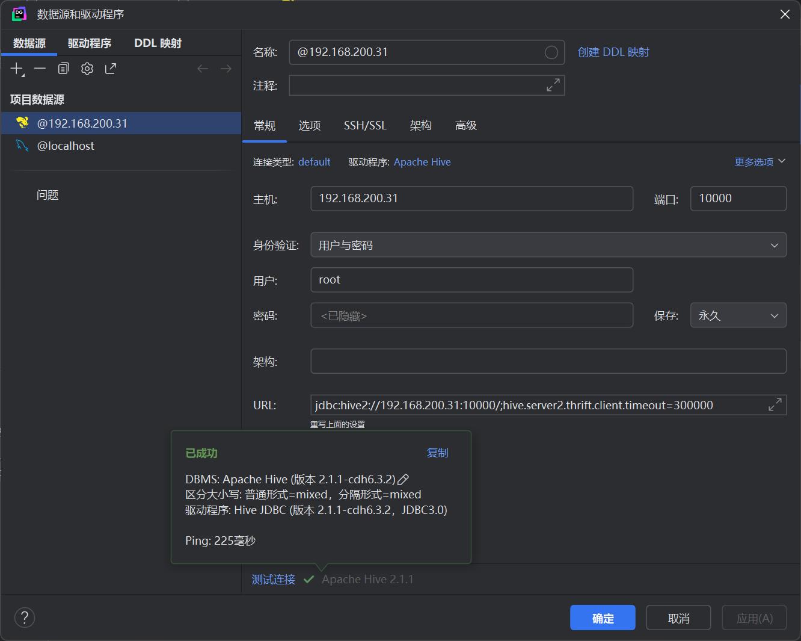

# day 01 日报
1.搭建虚拟机环境，安装zookeeper，yarn，hive，hdfs软件

2.尝试使用DataGrip连接虚拟机的hive数据库
第一次连接 报错 显示参数错误

出现这个错误，我尝试添加参数client_protocol，发现添加完参数后依然没有解决问题
我想可能是虚拟机hive的版本与DataGrip的hive依赖有问题，查看DataGrip的依赖，果然是这个问题，虚拟机的hive版本是2.1.1-cdh6.3.2,而DataGrip的依赖版本是3.1.2，所以我从虚拟机的hive文件夹下载相关的依赖

终于成功了！

但是随之而来的，又出现了执行sql语句速度极慢，sql能够执行成功，但是yarn没有接收到报告，现在我还没有找到解决这个问题的办法