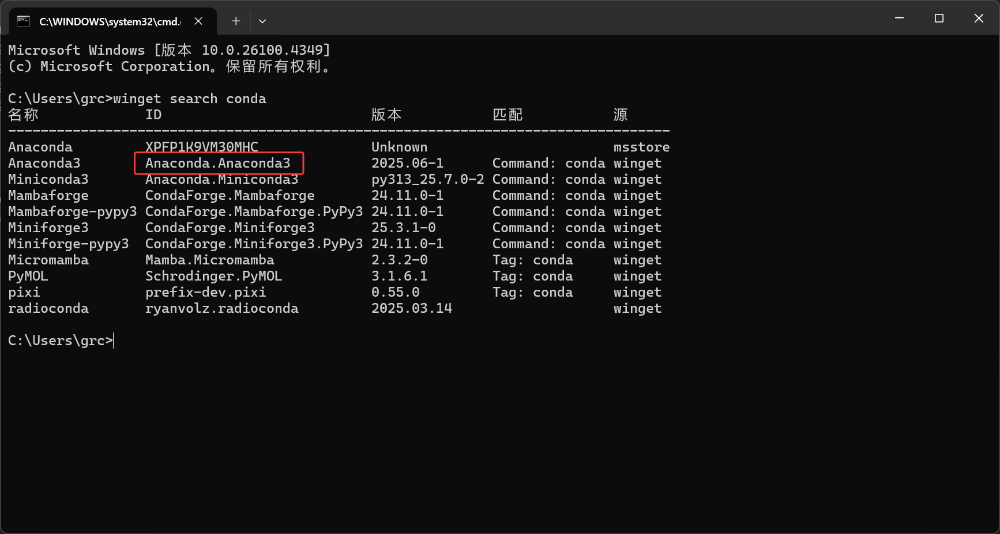
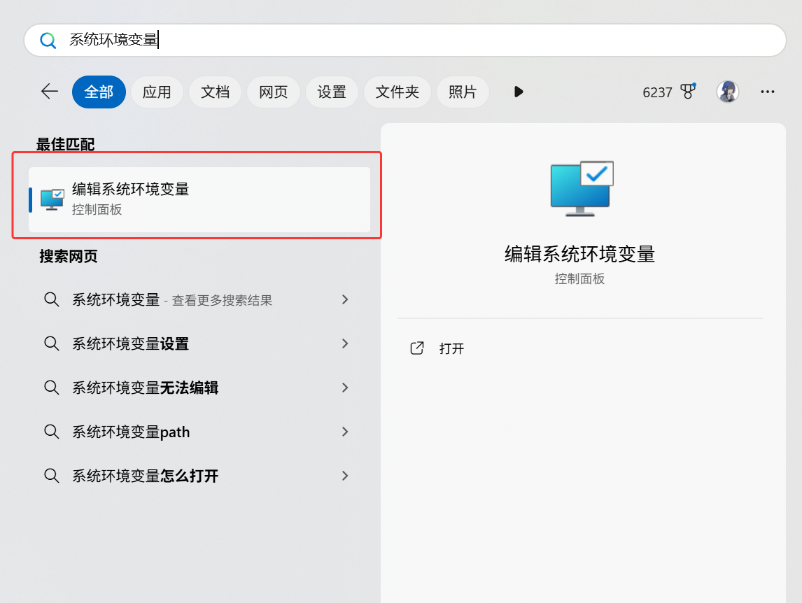
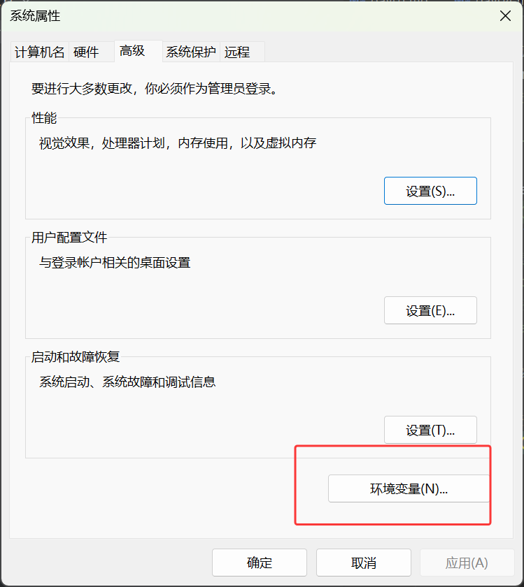
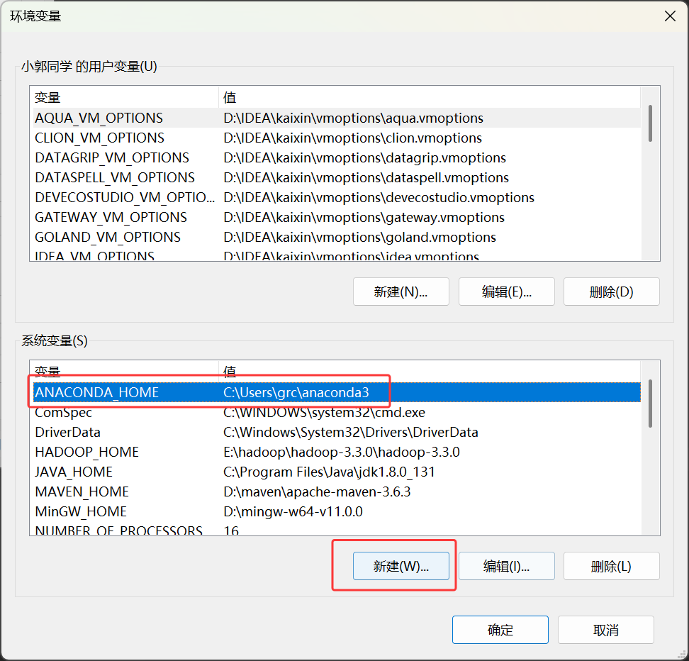
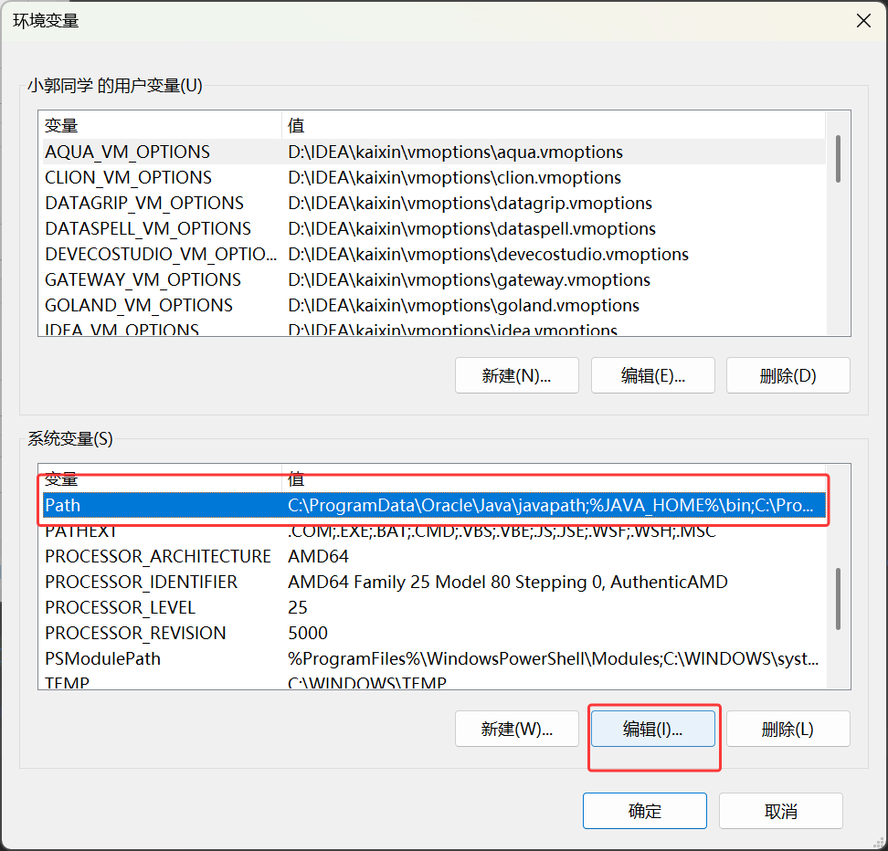
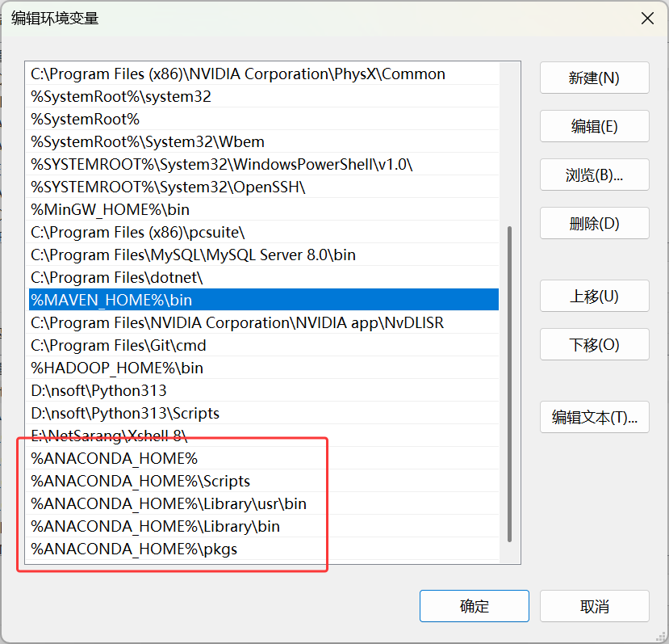
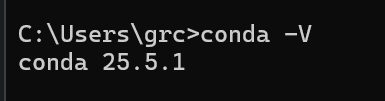

# day 06 日报
Anaconda安装流程
### 1.打开cmd下载Anaconda3，输入以下命令
>//查看conda安装包  
winget search conda

### 2.找到Anaconda3，复制软件的ID，输入以下命令

默认是安装在 C:\用户\用户名\anaconda3 目录下 可以通过在命令末尾添加 -d 指定安装目录
> //指定安装目录  
winget install Anaconda.Anaconda3 -d D:\<你的路径>  
//默认安装路径  
winget install Anaconda.Anaconda3

### 3.下载完成后就该设置conda环境变量了  

搜索框搜索环境变量

点击环境变量

找到系统变量下的新建，创建一个%ANACONDA_HOME% ，选择你conda的安装路径，我的路径是在C:\用户\用户名下的\anaconda3  
(如果你不想整这一步，可以跳过，直接看第四步)

之后找到Path，点击编辑

点击新建，配置如下五个变量

配置完成后点击确定，环境变量就配置完成了

### 4.查看conda环境
打开cmd，输入以下命令,输出版本好就是环境搭建好了
>conda -V

### 5.更换国内源
>#查看当前源  
conda config --show  
>
>#更换源
conda config --add channels https://mirrors.tuna.tsinghua.edu.cn/anaconda/cloud/msys2/ && conda config --add channels https://mirrors.tuna.tsinghua.edu.cn/anaconda/cloud/conda-forge && conda config --add channels https://mirrors.tuna.tsinghua.edu.cn/anaconda/pkgs/free/ && conda config --add channels https://mirrors.tuna.tsinghua.edu.cn/anaconda/cloud/pytorch/ && conda config --add channels https://mirrors.tuna.tsinghua.edu.cn/anaconda/pkgs/main/ && conda config --set show_channel_urls yes

### #在idea中创建 python conda 项目可能会出现的问题

CondaToSNonInteractiveError: Terms of Service have not been accepted for the following channels. Please accept or remove them before proceeding:

如果出现了这样的报错，解决方法如下
在andconda pormpt窗口或者cmd窗口中输入如下显示anconda信息
>conda search wxpython --info

会显示是否同意，输入 a 同意就行